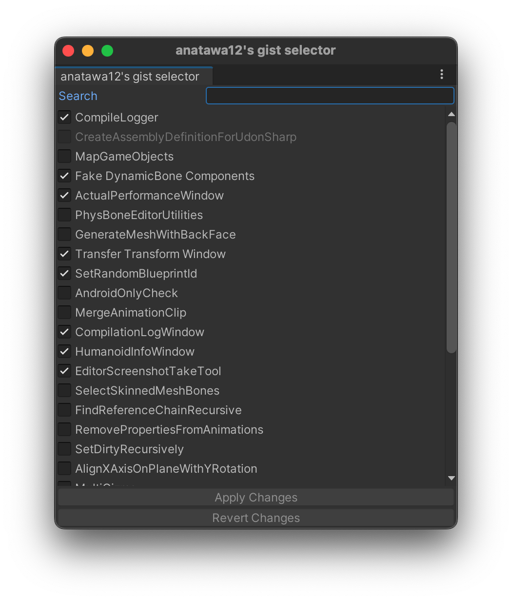

# Basic Usage

anatawa12's gist pack for Unityは複数のgistで構成されるため、インストール後に使用にしたいgistを有効化する必要があります。

選択ツールを`Tools/anatawa12's gist selector`から開いて、有効にしたいgistにチェックを入れ、`Apply Changes`をクリックしてください。

一番上の `Search` フィールドを使うと、名前や説明でフィルタリングできます。

依存関係がないパッケージは有効化できません。

例えば、SetRandomBlueprintIdはVRCSDK Base向けに作られているため、もしVRCSDK Baseがプロジェクトにないと無効化されています。\
また、ActualPerformanceWindowはVRCSDK Avatars向けに作られているため、もしVRCSDK Avatarsがプロジェクトにないと無効化されています。

