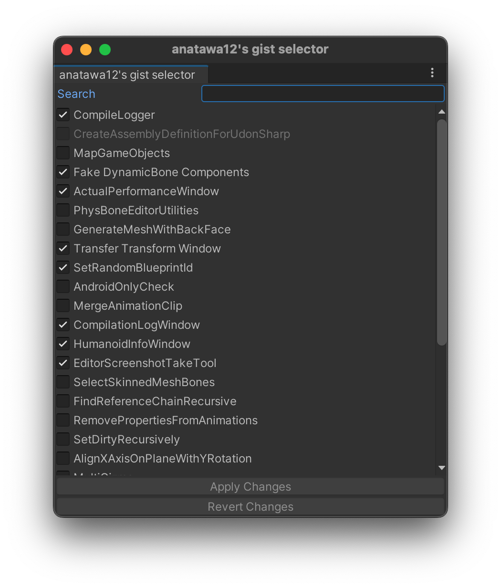

# Basic Usage

Unity Gist Pack consists of multiple gists so after installing this package, you have to enable some gists.

Please open selector window from `Tools/anatawa12's gist selector`, check gists you want to enable, and click `Apply Changes`.

Some package cannot be enabled because some dependency is missing.

For example, SetRandomBlueprintId is made for VRCSDK Base so if your project doesn't have VRCSDK Base, this is disabled. \
Also, ActualPerformanceWindow is made for VRCSDK Avatars so if your project doesn't have VRCSDK Avatars, this is disabled.

